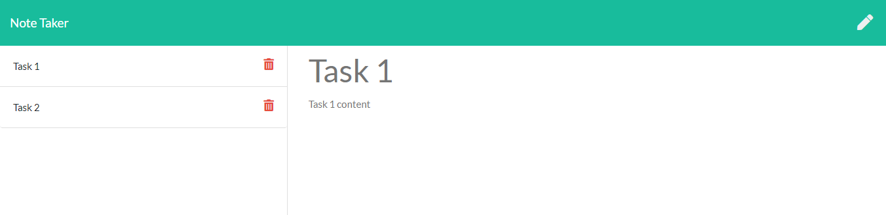

# Note Taker
### Welcome to my [Note Taker Website](https://thawing-plateau-64257.herokuapp.com/)

## Discription:
The application allows the users to write, save, and delete notes. 
This application uses:
- npm express: to save and retrieve note data from a JSON file.
- npm uuid: to generate a random unique id for every note.

## How to use
1. Go to the active website [here](https://thawing-plateau-64257.herokuapp.com/).
2. Click on the button "Get Started."
3. Fill in the title and the note content in the text areas.
4. Click the save icon on the top left corner to save.
5. Click on the pen icon on the top right corner to write new note.
6. Click the trash bin icon to delete previous notes.

## Get the code
1. Clone the folder from github
2. In the terminal, run the command "npm i"
3. Run the command "node server.js" to let server run
4. While the server is running, open a browser (chrome recommended), browse "localhost:3000" 

## Questions
Find me on github: [bnguyen467](https://github.com/bnguyen467)
 
Contact me through email: 467bnguyen@gmail.com

