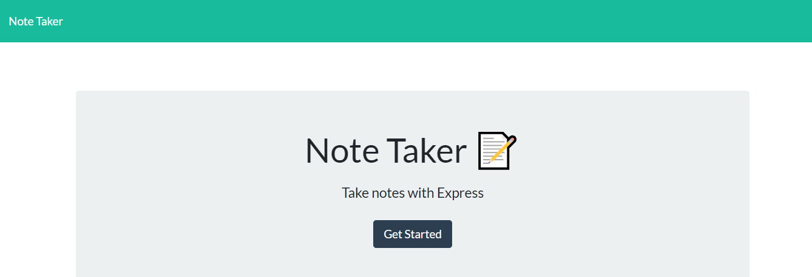

# Note Taker
### Welcome to my Note Taker Website

## Discription:
The application allows the users to write, save, and delete notes. 
This application uses:
- npm express: to save and retrieve note data from a JSON file.
- npm uuid: to generate a random unique id for every note.

## How to use
Link goes here

## Get the code
1. Clone the folder from github
2. In the terminal, run the command "npm i"
3. Run the command "node server.js" to let server run
4. While the server is running, open a browser (chrome recommended), browse "localhost:3000" 

## Questions
Find me on github: [bnguyen467](https://github.com/bnguyen467)
 
Contact me through email: 467bnguyen@gmail.com

